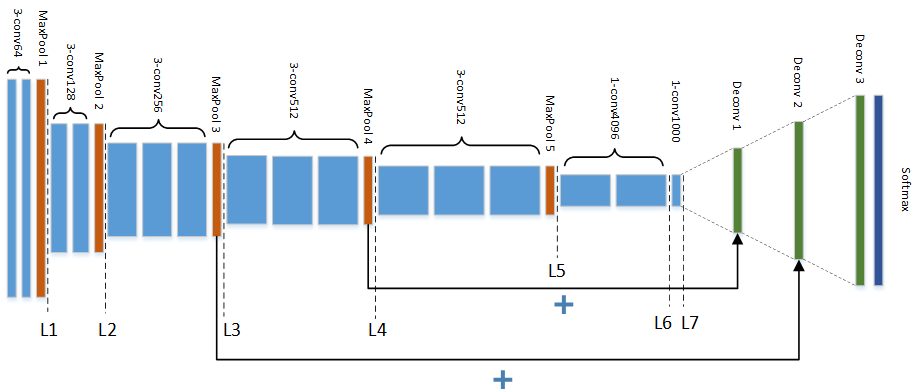

# Udacity Self-Driving car Nano-degree Term 3
# Project 12: Semantic Segmentation-Project

## 1. Introduction
Fully convolutional network (FCN)

In this project, we implement the fully convolutional network *FCN-VGG16* developed in the seminal paper by Shelhamer, Long, and Darrell, [Fully Convolutional Networks for Semantic Segmentation][1], and apply it to the [KITTI-Road-Dataset][2].

The collection consists of about 289 images together with their labeled ground truth images:

The pixels of an image are classified into two classes, **road** and **background**.

The FCN-VGG16 network looks as follows:

Here, `3-conv64`denotes a 3x3-convolutional layer with 64 output channels, `FC4096` and fully connected layer, and `MaxPool` a 2x2 maxpool layer etc.

Notice that the layer `L4` is being added to the first deconvolutional layer `Deconv 1`, and `L3` to the second deconvolutional layer `Deconv 2`.

## 2. The Program
The program utilizes the *Tensorflow*-framework and consists of three *Python*-files: `main.py`, `helper.py`, and `project_tests.py`. Of those three, the important ones for training and prediction are the `main`- and `helper`-modules.

Apart from the `run()`-function which is the entry point of the program, there are four functions in `main.py`: `load_vgg()`, `layers()`, `optimize()`, and `train_nn()`.

`load_vgg()`: Loads a pretrained VGG-model and returns handles for the internal layers, the input and output layers, and for the dropout parameter. These handles will be later needed to define the FCN, and for feeding while training the network.

`layers()`: This function defines the graph for the FCN. Using the tensor handles from above, we define the skip-layers using `tf.add()` and perform three deconvolutions using `tf.layers.conv2d_transpose()`.

`optimize()`: Chooses an optimization operation. In our case, we chose an [Adam-optimizer][3].

`train_nn()`: This function trains the Fully-convolutional neural network. However, before doing that, it will initialize all variables of the network first.

`gen_batch_function()`: This function returns a generating function which creates the mini-batches for the training loop. The generating function (`get_batches_fn()`) itself returns two lists of input images and label images of prescribed length each.

The main task of the `run()`-function is to open (and eventually close) a Tensorflow-session `sess` and call all of the above functions one by one to define and train the FCN.

After the FCN has been trained, the helper function `helper.save_inference_samples()` is being called which creates the inference images using the trained network and saves to a subfolder in the `runs/`-directory.

## 2. How to run the Project
The project can be run by launching `python main.py`.
The main script launches and loads a pretrained VGG-model.
It proceeds to train the new convoluted neural network using the .

## 3. Results
The model was trained on a workstation with a 6th generation Intel i5 CPU, 16GB RAM, and a Nvidia GTX1060 GPU with 6GB VRAM. Due to memory constraints the batch size, parametrized by `BATCH_SIZE`, was restricted to 8.

The inference iamges are saved in the `runs/` folder, each within a separate directory denoted by a time tag in the format `YYYYmmDD_HHMM`.

The following set of images are the inference results without L2-regularizer (first set) and with one:

Image without L2-regularizer:

Image with L2-regularizer:

Image without L2-regularizer:

Image with L2-regularizer:

Image without L2-regularizer:

Image with L2-regularizer:

One can clearly see that the roads are largely labeled correctly. However, false positives stand out, such as the incorrectly classified segments of the sidewalks in the first and third image, or the pylon in the second image.

[1]: https://arxiv.org/abs/1605.06211
[2]: http://www.cvlibs.net/datasets/kitti/eval_road.php
[3]: https://arxiv.org/abs/1412.6980
